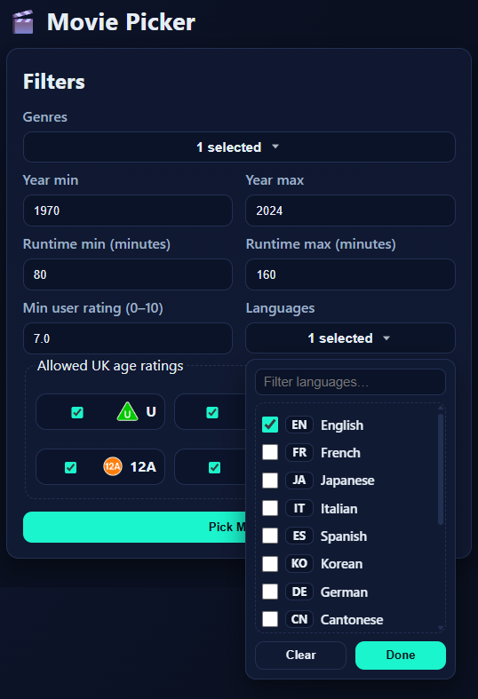
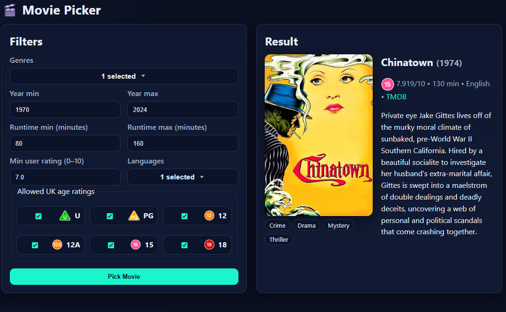

## 🎬 Movie Picker

A web application that allows the user to get a movie suggestion based on their preferences.

Powered by [FastAPI](https://fastapi.tiangolo.com/), [TMDB](https://www.themoviedb.org/) data, and a local SQLite database. 

## Tech Stack

- **Backend:** [FastAPI](https://fastapi.tiangolo.com/)  
- **Frontend:** Jinja2 templates + custom CSS  
- **Database:** SQLite  
- **APIs:** [TMDB](https://developers.themoviedb.org/) (requires API key)  
- **Other:** python-dotenv, requests 

## Project Structure

```
movie-picker/
├── app.py
├── movie_picker.py
├── db.py
├── tmdb_fetch.py
├── bulk_seed.py
├── schema.sql
├── requirements.txt
├── README.md
├── templates/
│ └── index.html
├── static/
│ ├── style.css
│ └── bbfc/
│ ├── U.svg.png
│ ├── PG.svg.png
│ ├── 12.svg.png
│ ├── 12A.svg.png
│ ├── 15.svg.png
│ └── 18.svg.png
└── docs/
└── screenshots/
├── filters.png
├── result.png
└── dropdowns.png
```

## Setup

1. Clone the repo
   ```bash
   git clone https://github.com/sammaslen/projects/movie-picker.git
   cd movie-picker
   ```
2. Create a virtual environment
   ```bash
   python -m venv venv
   source venv/bin/activate   # Linux/Mac
   venv\Scripts\activate      # Windows
   ```
3. Install dependencies
   ```ini
   pip install -r requirements.txt
   ```
4. Set your TMDB API key
   Create a file tmdb.env in the project root:
   TMDB_API_KEY=your_tmdb_api_key_here
   ```
## Seed the Database

Run bulk_seed.py to seed the database. Make any tweaks you like to choose which type of films it gets.

## Run the app
   ```bash
   uvicorn app:app --reload
   ```
Then open your browser at http://127.0.0.1:8000/

## Screenshots

- **Filter form:**

  

- **Result card:**

  

